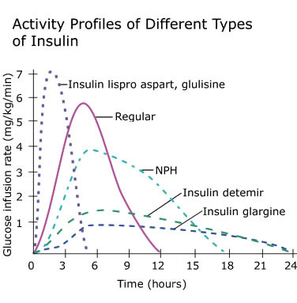

# Insulins


Insulins are synthetic polypeptide hormones. They:

* Have a similar mechanism of action and pharmacodynamics of endogenous insulin
* One unit of insulin is defined as the amount required to make a previously healthy 2kg rabbit hypoglycaemic

## Types of Insulin

Different insulins are categorised by their time of **onset**, **peak**, and **duration**, and are classified as either:

* Fast acting
* Intermediate acting
* Long acting

{fig-alt="Graph comparing the approximate activity profiles of rapid-acting insulin analogues, regular insulin, NPH, insulin detemir and insulin glargine over 24 hours."}

### Fast Acting

Fast acting insulins are used for controlling BSL spikes post meals, and for control of hyperglycaemia. Administered subcutaneously they have an:

* Onset of 5-15 minutes
* Peak at 1-2 hours
* Last 4-6 hours.

Fast acting insulins include:

* Insulin Aspart (Novorapid)
* Insulin Lispro (Humalog)

### Intermediate Acting

Intermediate acting insulins are used for control of BSL between meals as a pseudo-basal bolus. Administered subcutaneously they have an:

* Onset of 1-2 hours
* Peak at 4-6 hours
* Last >12 hours

Intermediate acting insulins include:

* NPH
* Protophane

### Long Acting

Long acting insulins are used for creating a baseline insulin level. Administered subcutaneously they have an:

* Onset of 1-1.5 hours
* Peak at 5 hours
* Last 24 hours

Long-acting insulins include:

* Insulin glargine (Lantus)
* Insulin detemir (Levemir)

```{r}
source("scripts/drugtables.R")

DrugTable("insulin_aspart", "insulin_lispro", "insulin_isophane", "insulin_glargine", "insulin_detemir", caption = "Exogenous Insulin Preparations")
```

***

## References

1. UCSF Diabetes Teaching Center. [Types of Insulin for Type 1 Diabetes](https://diabetesteachingcenter.ucsf.edu/content/types-of-insulin-for-type-1-diabetes). Accessed September 2026.
2. Activity profiles of different types of insulin. UCSF Diabetes Teaching Center.
3. Mudaliar S, Mohideen P, Deutsch R, Ciaraldi TP, Armstrong D, Kim B, Sha X,
Henry RR. [Intravenous glargine and regular insulin have similar effects on
endogenous glucose output and peripheral activation/deactivation kinetic
profiles](https://www.ncbi.nlm.nih.gov/pubmed/12196433/?ncbi_mmode=std). Diabetes Care. 2002 Sep;25(9):1597-602.
4. Smith S, Scarth E, Sasada M. Drugs in Anaesthesia and Intensive Care. 4th Ed. Oxford University Press. 2011.
